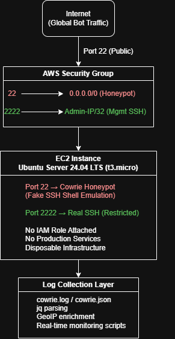

# AWS Cloud Security Case Study – SSH Honeypot Deployment & Attack Analysis

## Overview

This project presents a cloud-based SSH honeypot deployed on AWS to analyze real-world brute-force attacks and automated reconnaissance behavior.

The infrastructure intentionally exposes an SSH endpoint to the public internet while isolating the underlying host system through strict network segmentation and port separation. Attack activity is captured using Cowrie, an SSH/Telnet honeypot framework that emulates a Linux shell environment without granting real system access.

The objective of this project is to demonstrate secure cloud deployment practices, attack surface control, and operational monitoring in an intentionally exposed infrastructure scenario.

### Key Characteristics

- AWS EC2 deployment (Ubuntu 24.04 LTS)
- Public SSH exposure (Port 22)
- Restricted management channel (Port 2222, IP-limited)
- No IAM role attached
- Disposable infrastructure design
- Real-time attack logging and monitoring

## Technologies & Stack

- **AWS EC2** – Public cloud infrastructure
- **Ubuntu Server 24.04 LTS** – Host system
- **Cowrie Honeypot** – SSH service emulation & attack logging
- **Security Groups** – Network access control
- **jq & GeoIP** – Log parsing and geographic enrichment
- **Bash scripting** – Real-time monitoring automation

## Security Architecture

The honeypot infrastructure follows a strict isolation and exposure control model.

### 1. Controlled Public Exposure
Port 22 is intentionally exposed to the public internet to attract automated brute-force attempts and reconnaissance traffic.

### 2. Isolated Management Channel
Administrative SSH access is moved to port 2222 and restricted to a single trusted IP address (/32). This prevents direct host access via the publicly exposed port.

### 3. No IAM Role Attached
The EC2 instance operates without an attached IAM role to eliminate privilege escalation paths within the AWS environment.

### 4. Disposable Infrastructure Design
The instance contains no production workloads or sensitive data. In case of compromise, the instance can be terminated without further impact.

### 5. Attack Logging & Monitoring
All attacker interactions are captured via Cowrie and processed using structured JSON logs, enabling behavioral analysis and credential pattern evaluation.

  

## Threat Observations & Metrics

### 1. Automated Credential Stuffing

Within ~36 hours of exposure, the instance received continuous brute-force login attempts targeting primarily the `root` and `admin` accounts.

Observed password patterns included:

- Sequential numeric passwords (1 → 123456789)
- Default Linux credentials (root, ubuntu, debian, centos)
- Common weak passwords (password, passw0rd, welcome)

### 2. Immediate Post-Exploitation Enumeration

After successful login attempts, attackers executed automated environment fingerprinting commands:

- `uname`, `lscpu`, `dmidecode`
- `/proc/uptime` inspection
- GPU detection via `lspci`
- Honeypot detection using `/dev/null` checks
- Miner process discovery (`ps | grep miner`)

This indicates automated post-compromise reconnaissance rather than manual interaction.

The use of ps | grep '[Mm]iner' suggests botnet competition.
Automated malware commonly checks for existing crypto-mining processes and attempts to terminate them before deploying its own payload.

### 3. Global Attack Sources

Attack traffic originated from multiple geographic regions including:

UK, Japan, Russia, Vietnam, China, USA, Belgium, Sweden, and Canada.

This confirms that publicly exposed SSH services in cloud environments are scanned globally within hours of deployment.

### 4. Statistical Overview

#### Authentication Outcome

> **Total login attempts:** 200  
> **Successful authentications:** 17  
> **Success rate:** 8.5%

---

#### Post-Compromise Activity  
*(Based on 17 successful sessions)*

| Activity                              | Percentage |
|---------------------------------------|------------|
| CPU enumeration                      | 41%        |
| GPU detection                        | 35%        |
| Full automated fingerprinting        | 35%        |
| Honeypot detection checks            | 12%        |
| Miner process discovery              | 6%         |

---

#### Key Observation

The majority of successful compromises were immediately followed by automated system resource evaluation, indicating preparation for potential cryptomining deployment.

## Conclusion

This project demonstrated how quickly publicly exposed SSH services in cloud environments are discovered and targeted by automated attack infrastructure.

Within hours of deployment, the instance was scanned and subjected to continuous credential-stuffing attempts originating from globally distributed sources. Successful logins were immediately followed by scripted post-exploitation activity focused on system fingerprinting, hardware resource evaluation, and miner competition checks. The behavior strongly indicates automated botnet operations rather than manual intrusion attempts.

The findings highlight an important cloud security principle: internet-facing services are not passively exposed — they are actively and continuously probed.

From an architectural perspective, this experiment reinforces the importance of:

- Minimizing public attack surface
- Enforcing strict network segmentation
- Restricting administrative access paths
- Applying least-privilege principles at both host and cloud levels
- Monitoring exposed services in real time

Public SSH exposure may be operationally necessary in certain scenarios, but it requires strong hardening measures such as key-based authentication, IP allowlisting, bastion architectures, or managed access services.

The experiment confirms that even short-lived cloud resources become part of the global attack surface immediately after exposure.

## Future Improvements

No full malware payload downloads were observed during the experiment. Increasing the realism of the host environment may improve the likelihood of triggering advanced post-exploitation stages in future iterations.

> This project was deployed in an isolated AWS environment for research and educational purposes only. No production systems or third-party assets were involved.
